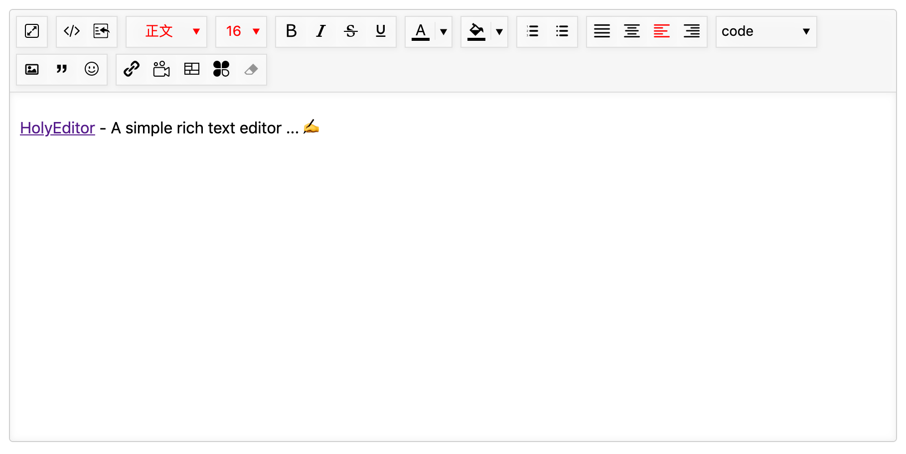

# HolyEditor

### [Demo](https://cedcn.github.io/holy-editor/)  👈👈👈


## Install
```
$ npm install holy-editor --save
```

or

```
$ yarn add holy-editor
```

## Usage for webpack

```javascript
import HolyEditor from 'holy-editor';

const editor = new HolyEditor(selector [,options]);
```

### selector

default: '#editor'

### options

  - toolbars: Array

    > Display what tools you'll need. Grouping by '|' separator.

  - theme: String

  - tools: Object

    > Each tools can be configure. key value is the tool's name of camel format.

### methods

- setValue(value: String)

- getValue()

- append(value: String)

- clear()

### Upload image to Qiniu

- 在页面中引入 qiniu.min.js

- 初始化 uploader (请确保在执行初始化时，页面已经引入 plupload)：

Example:

```javascript
tools: {
  image: {
    service: 'remote',
    uploadInit: (dom, successCb) => {
      Qiniu.uploader({
        runtimes: 'html5,flash,html4',
        browse_button: 'upload-button',
        uptoken: '<Your upload token>',
        domain: '<Your bucket domain>',
        get_new_uptoken: false,
        unique_names: false,
        max_file_size: '1000mb',
        filters: {
          mime_types: [
            { title: 'Image files', extensions: 'jpg,jpeg,gif,png,bmp' }
          ]
        },
        max_retries: 3,
        dragdrop: true,
        drop_element: 'upload-button',
        chunk_size: '4mb',
        auto_start: true,
        init: {
          UploadProgress: (up, file) => {
            // Progress
          },
          FileUploaded: (up, file, info) => {
            const domain = up.getOption('domain');
            const res = $.parseJSON(info.response);
            const sourceLink = `${domain}/${res.key}`; // 获取上传成功后的文件的Url
            successCb(sourceLink);
          },
          UploadComplete: () => {
            // Complete
          },
          Error: () => {
            alert('Upload error!');
          },
          Key: (up, file) => {
            const timestr = Date.now().toString();
            const suffix = timestr.substr(timestr.length - 5);
            const filename = `${suffix}${file.name}`;
            return `uploads/editor/${filename}`;
          }
        }
      });
    }
  }
}
```
For reference only.

Datils configuration please to visit: [Qiniu javascript sdk](https://developer.qiniu.com/kodo/sdk/1283/javascript)

## How to extension?

... ...
